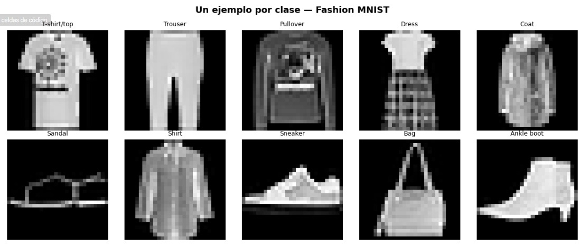
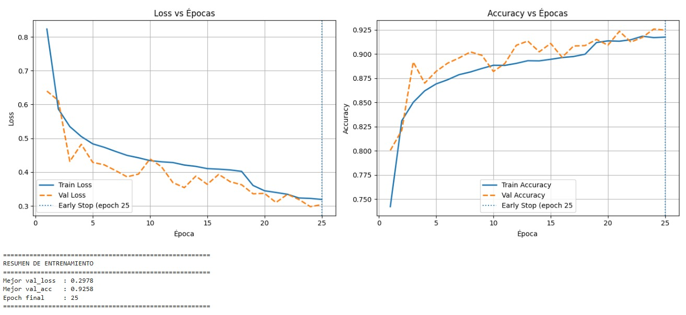
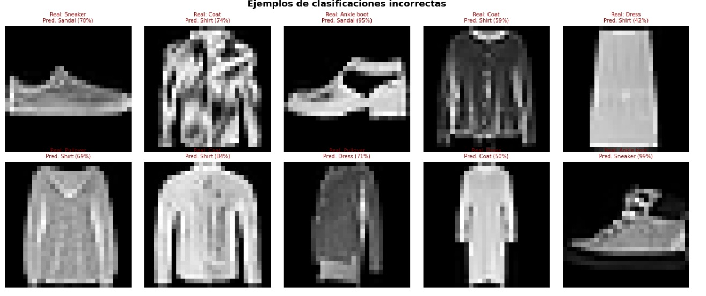
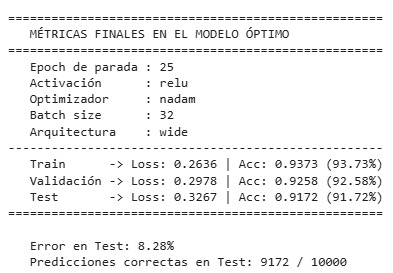

# Fashion MNIST Classification with CNN

## Descripción

Proyecto de Deep Learning enfocado en la clasificación de imágenes utilizando Redes Neuronales Convolucionales (CNN) sobre el dataset Fashion MNIST.

El objetivo del proyecto es desarrollar y evaluar un modelo capaz de clasificar automáticamente prendas de vestir utilizando técnicas de visión computacional y Deep Learning con TensorFlow y Keras.

---

## Tecnologías utilizadas

- Python
- TensorFlow
- Keras
- NumPy
- Matplotlib
- Scikit-learn

---

## Dataset

Se utilizó el dataset Fashion MNIST, compuesto por imágenes en escala de grises de tamaño 28x28 pertenecientes a 10 categorías de ropa.

### Clases del dataset

- T-shirt/top
- Trouser
- Pullover
- Dress
- Coat
- Sandal
- Shirt
- Sneaker
- Bag
- Ankle boot

---

## Arquitectura del modelo

La red neuronal convolucional implementada incluye:

- Capas convolucionales
- MaxPooling
- Dropout
- Flatten
- Capas densas fully connected
- Softmax para clasificación multiclase

---

## Procesamiento y entrenamiento

- Normalización de imágenes
- División de datos de entrenamiento y prueba
- Comparación de funciones de activación
- Comparación de optimizadores
- Evaluación mediante accuracy y loss

---

## Visualización de datos

### Ejemplos del dataset



---

## Curvas de entrenamiento

### Accuracy y Loss durante el entrenamiento



---

## Resultados del modelo

### Evaluación del desempeño



---

## Resultados de entrenamiento



---

## Estructura del proyecto

```bash
fashion-mnist-cnn/
│
├── fashion_mnist_cnn.ipynb
├── README.md
├── requirements.txt
└── imagenes/
    ├── CurvasEntrenamiento.jpeg
    ├── Resultados.jpeg
    ├── ResultadosEntrenamiento.jpeg
    └── datos.jpeg
```

---

## Instalación

Clonar el repositorio:

```bash
git clone https://github.com/Jeison817/fashion-mnist-cnn.git
```

Instalar dependencias:

```bash
pip install -r requirements.txt
```

---

## Objetivos del proyecto

- Aplicar técnicas de Deep Learning para clasificación de imágenes.
- Implementar y evaluar Redes Neuronales Convolucionales.
- Analizar el impacto de optimizadores y funciones de activación.
- Explorar métricas de desempeño en modelos CNN.

---

## Autor

Jeison Josimar Contreras Meza

- GitHub: github.com/Jeison817
- LinkedIn: linkedin.com/in/jeison-josimar-contreras-meza-b45938357
